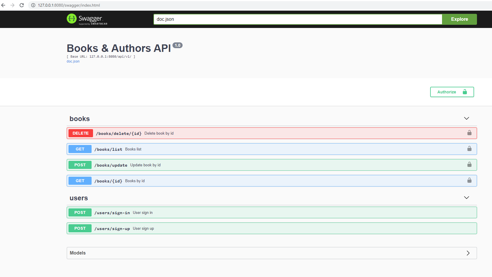

## Тестовое задание.

**Условие**:

Есть две сущности - книги и авторы, у каждой книги один автор, у автора может быть несколько книг. Необходимо реализовать сервис со следующими эндпоинтами:

GET /api/v1/books/list получение списка книг с именем автора

GET /api/v1/books/by-id получение данных книги по -id

POST /api/v1/books/update обновление данных книги

DELETE /api/v1/books/id удаление записи книги из бд

## Описание прокета.
**Общая информация.**
Я решил усложнить условие задачи, и добавил следующие моменты:
1. Сделать авторизацию/регистрацию.
2. При вызове эндпоинтов /api/v1/books/... проверять авторизацию с помощью JWT

**Функционал**:
* авторизация/регистрация, после авторизации генерация и выдача JWT
* функционал для 4 эндпоинтов, описанных в задаче

**Стек**: docker, Golang 1.16 (и различные пакеты для него), MySQL.

## Тестирование проекта
После запуска проекта по адресу `http://127.0.0.1:8080/swagger/index.html` будет доступна документация в swagger.

Внешний вид документации стандартный, представлен на скриншоте ниже

Для регистрации и авторизации нужны эндпоинты из группы `users`. После вызова `/users/sign-up` создастся новый пользователь. 
После этого необходимо авторизоваться с помощью эндпоинта `/users/sign-in`, который вернет в ответе JWT токен.

Далее необходимо нажать кнопку "Authorize" и в открывшемся окне в текстовом поле ввести строку в формате `Bearer <полученный токен>`
После этого появится возможность работы с эндпоинтами из группы books.